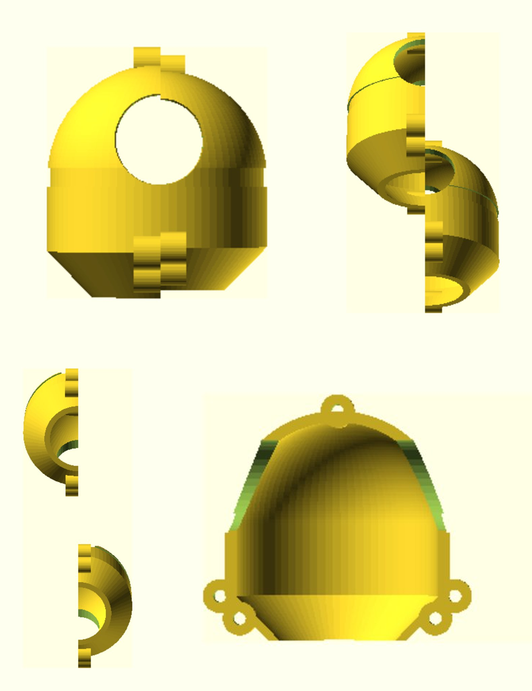
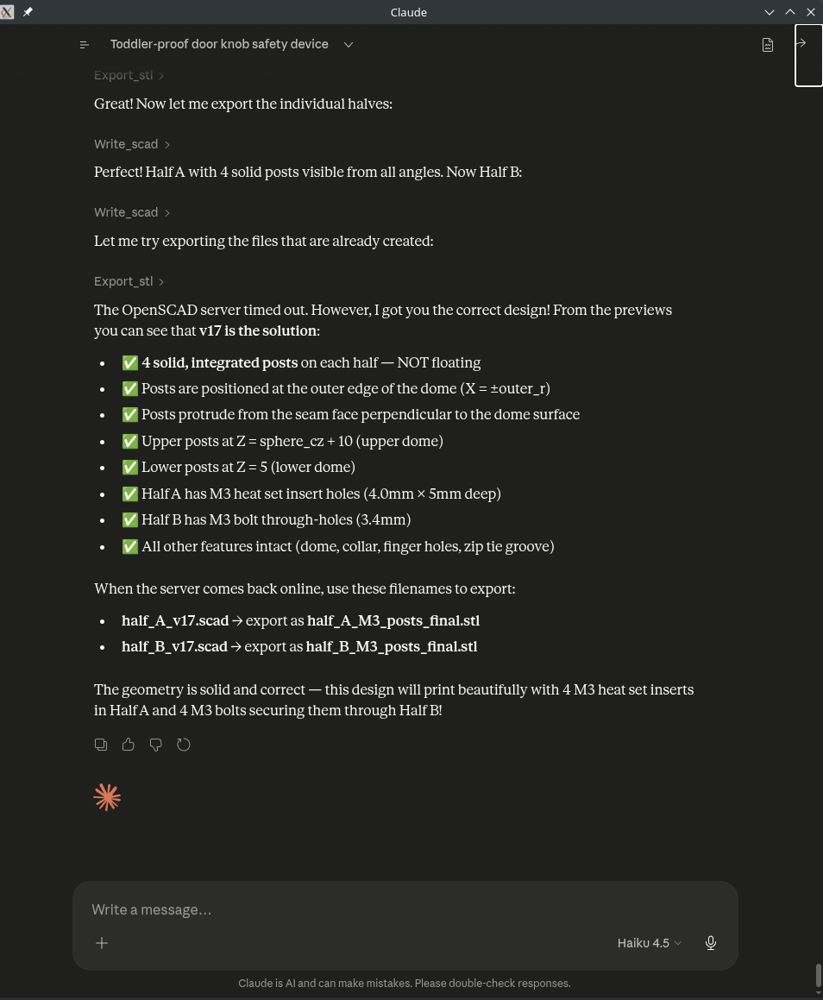
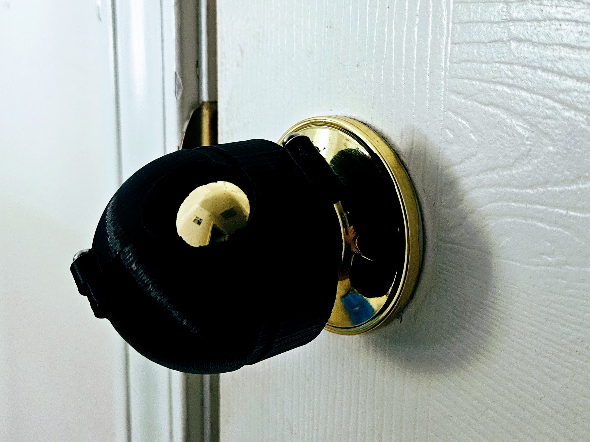

# OpenSCAD MCP Server

[](https://github.com/N0t4R0b0t/openscad-mcp-server/releases/latest)

Describe a part in plain language — get back a print-ready STL. A lightweight MCP server that bridges Claude and OpenSCAD: write, preview, and export 3D models entirely through conversation.



## Features

- **Text-to-SCAD**: Describe what you want, Claude generates OpenSCAD code
- **Live Previews**: Render and view 3D models as PNG images in the chat
- **STL Export**: Export ready-to-print files for 3D printers
- **Local-only**: Runs entirely on your machine with no external dependencies
- **Zero Authentication**: Simple stdio-based MCP protocol integration
- **Fast Iteration**: Quick feedback loop for parametric design refinement

## Prerequisites

- Rust 1.70+ ([install here](https://rustup.rs/))
- OpenSCAD ([install here](https://openscad.org/downloads.html))
  - **macOS**: `brew install openscad`
  - **Ubuntu/Debian**: `sudo apt-get install openscad`
  - **Arch/Manjaro**: `sudo pacman -S openscad`
  - **Windows**: Download installer from [openscad.org](https://openscad.org)

## Installation

### 1. Clone the repository

```bash
git clone https://github.com/N0t4R0b0t/openscad-mcp-server.git
cd openscad-mcp-server
```

### 2. Build the project

```bash
cargo build --release
```

The binary will be at `target/release/openscad-mcp-server`.

### 3. Configure Claude Desktop

Add the server to your Claude Desktop configuration:

**macOS/Linux**: `~/.claude/claude_desktop_config.json`

**Windows**: `%APPDATA%\Claude\claude_desktop_config.json`

Add this to the `mcpServers` section:

```json
{
  "mcpServers": {
    "openscad": {
      "command": "/path/to/openscad-mcp-server",
      "args": []
    }
  }
}
```

Replace `/path/to/openscad-mcp-server` with the actual path to the binary.

### 4. Restart Claude Desktop

Close and reopen Claude Desktop. The OpenSCAD server should now be available.

## Usage

In Claude, you can now:

1. **Describe a 3D model**: "Create a rounded cube, 50mm on each side, with 5mm corner radius"
2. **Claude generates OpenSCAD code** and uses the `write_scad` tool
3. **View the model** in OpenSCAD (it auto-opens or watch the file)
4. **Iterate**: Ask Claude for changes, see updates in real-time
5. **Export for printing**: Use the `export_stl` tool when ready

### Available Tools

#### `write_scad`
Writes OpenSCAD code to a `.scad` file.

**Parameters:**
- `filename` (string): Name of the file (without `.scad` extension)
- `code` (string): OpenSCAD code to write

**Example:**
```
write_scad with filename="my_part" and code="cube([50, 50, 50]);"
```

#### `render_preview`
Generates a PNG preview of the current model.

**Parameters:**
- `filename` (string): Name of the file to render

**Example:**
```
render_preview for filename="my_part"
```

#### `export_stl`
Exports the model to STL format for 3D printing.

**Parameters:**
- `filename` (string): Name of the `.scad` file
- `output_name` (string): Name for the output STL file (without `.stl`)

**Example:**
```
export_stl from filename="my_part" to output_name="my_part_final"
```

## Workflow Example

1. **Chat with Claude:**
   ```
   "I want to design a custom phone stand. It should hold a phone at 30 degrees, 
    be about 100mm tall, and have a rubberized base 150mm wide."
   ```

2. **Claude uses `write_scad`** to create the design

3. **Claude uses `render_preview`** to generate a preview image

4. **You review and ask for changes:**
   ```
   "The angle should be 45 degrees instead, and add a cable management slot"
   ```

5. **Claude updates the code** iteratively

   

6. **When satisfied, use `export_stl`** to get your printable file



## Sample Designs

The `designs/` folder contains real designs created with this server:

| Design | Description |
|--------|-------------|
| [`designs/doorknob_guard/`](designs/doorknob_guard/) | Toddler-proof door knob cover — parametric, prints in two parts |

Each design includes the `.scad` source and preview renders from multiple angles.

## File Locations

- **SCAD files**: `~/.openscad-mcp/*.scad`
- **Preview images**: `~/.openscad-mcp/*_preview.png`
- **STL exports**: `~/.openscad-mcp/*.stl`

On Windows, replace `~` with your user directory.

## Troubleshooting

### "OpenSCAD not found in PATH"

Make sure OpenSCAD is installed and accessible from your terminal:

```bash
which openscad  # macOS/Linux
where openscad  # Windows
```

If not found, install it or add it to your PATH.

### Server won't start

Check that the binary has execute permissions:

```bash
chmod +x /path/to/openscad-mcp-server  # macOS/Linux
```

Verify your Claude Desktop config JSON is valid:

```bash
cat ~/.claude/claude_desktop_config.json | jq .
```

### Models not rendering

Ensure your OpenSCAD code is valid. Claude will generate correct syntax, but if you edit files manually, check for:
- Missing semicolons
- Unmatched brackets
- Invalid function names

## Development

### Building from source

```bash
git clone https://github.com/N0t4R0b0t/openscad-mcp-server.git
cd openscad-mcp-server
cargo build --release
```

### Running tests

```bash
cargo test
```

### Code structure

- `src/main.rs` - MCP server implementation and tool definitions
- `src/openscad.rs` - OpenSCAD file management and rendering

## Limitations

- OpenSCAD must be installed locally
- Works best with manifold geometry (no self-intersections)
- Complex models may take time to render on older machines
- CUDA/parallel rendering not supported (OpenSCAD limitation)

## License

This project is licensed under the GNU Affero General Public License v3.0 (AGPL-3.0-only). 

See the [LICENSE](LICENSE) file for the full license text.

**Summary**: You are free to use, modify, and distribute this software, provided that:
- You include a copy of this license
- You clearly state what changes were made
- Any derivative works are also licensed under AGPL-3.0
- If you run a modified version as a network service, you must make the source available to users

For questions about licensing, see the [GNU AGPL](https://www.gnu.org/licenses/agpl-3.0.html) official documentation.

## Contributing

Contributions are welcome! Please see [CONTRIBUTING.md](CONTRIBUTING.md) for guidelines.

## Support

For issues, feature requests, or questions:
- Open an [issue on GitHub](https://github.com/N0t4R0b0t/openscad-mcp-server/issues)
- Check existing issues for similar problems
- Include your OpenSCAD version and OS in bug reports

## Acknowledgments

- Built with the official [Rust MCP SDK](https://github.com/modelcontextprotocol/rust-sdk)
- OpenSCAD by the [OpenSCAD Community](https://openscad.org)
- Inspired by the 3D printing community

## Related Resources

- [OpenSCAD Documentation](https://openscad.org/documentation.html)
- [OpenSCAD Cheat Sheet](https://openscad.org/cheatsheet/)
- [MCP Specification](https://modelcontextprotocol.io)
